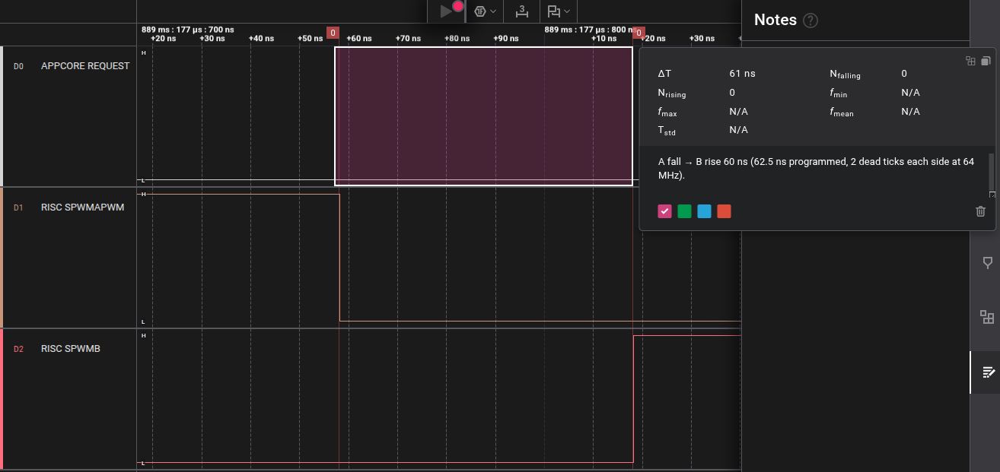
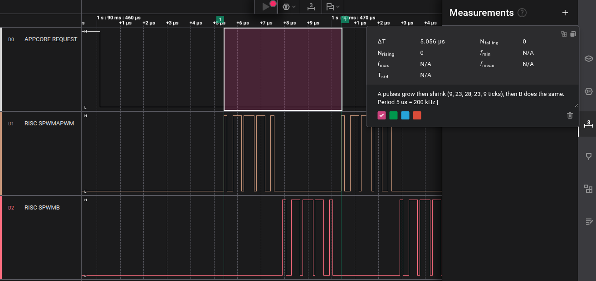
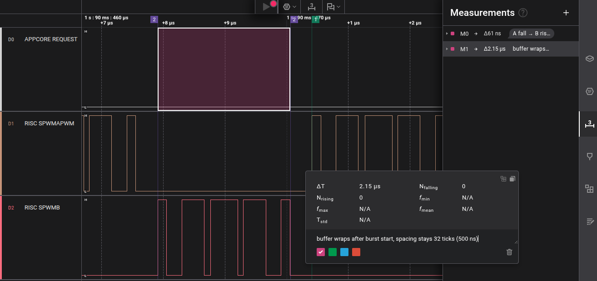
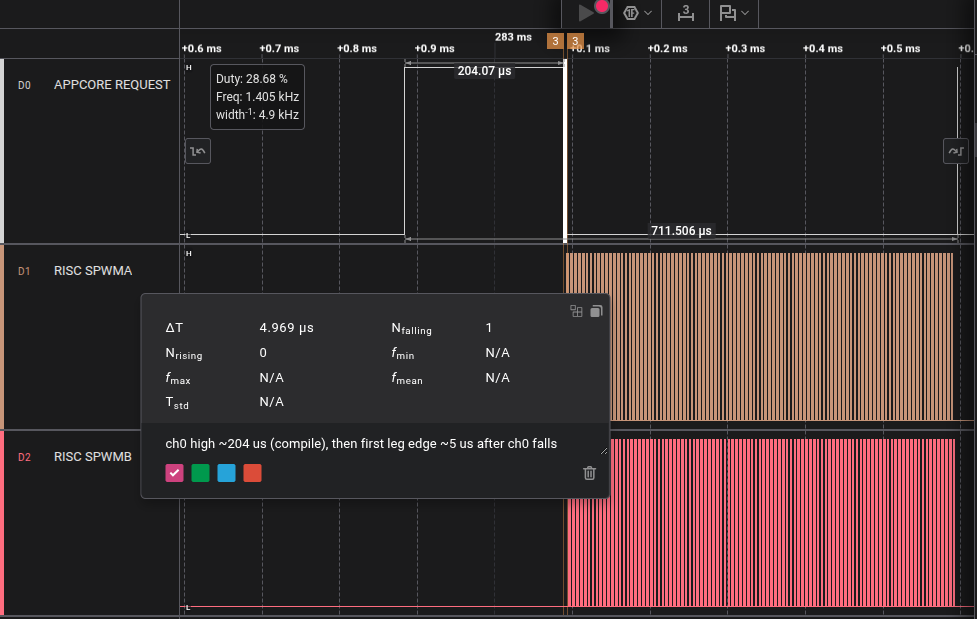
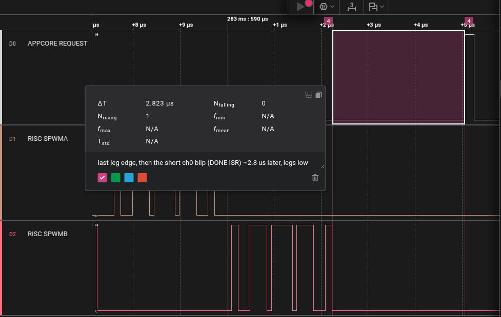
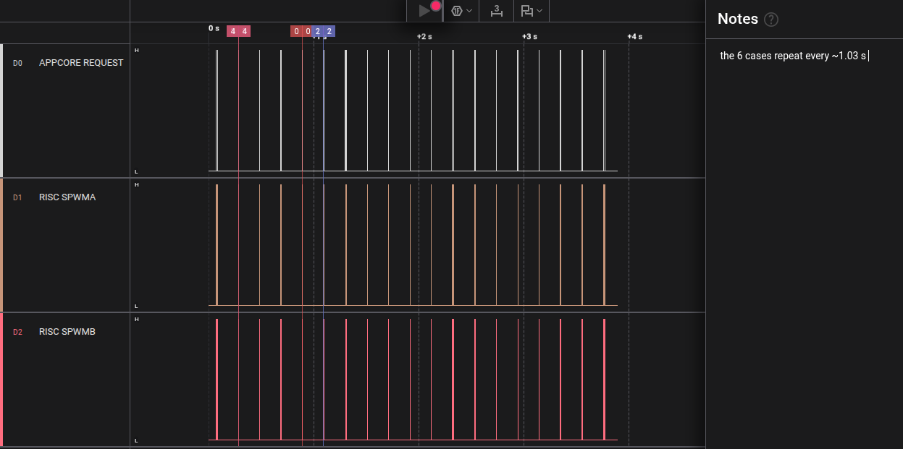

# flpr_spwm

Drives a software PWM through the FLPR, the small extra processor inside the nRF54L15.
Picture's worth a thousand words, so here's a high level overview.


## Overview
Drives two pins with any on/off pattern you like, in 7.8 ns steps, for when the PWM peripheral doesn't do exactly what you want. The pattern plays on its own without the main processor touching every edge, and the two pins are never on at once, with a gap (dead time) you choose between them. The sine-shaped pulse train in `src/main.c` is one example of a pattern.

## high-level flow
- The main processor works out when each of two output pins should turn on and off.
- It hands that plan to the FLPR and tells it to start.
- The FLPR switches the pins on its own, so the main processor is free for other work.
- When the FLPR is done, it tells the main processor.

The frequency can only be `tick x M / L`: M sine cycles in a buffer of L ticks, where L is a multiple of 16. The planner tries every L up to your cap and keeps the closest match, so a longer cap gives a finer step. Every pulse width and dead time is a whole number of ticks, 7.8 ns at 128 MHz, the finest this chip can do. The cost of a big buffer is a slower frequency change (up to about 2 ms) and a longer build (up to about 80 ms).

```
 you: frequency, carrier ratio, depth, dead time, tick, buffer cap
   |
   v
 main processor   spwm_sine_plan()   closest frequency the chip can make
                  spwm_sine_build()  one pulse per carrier period
                  spwm_compile()     packs 2 bits per tick, rejects A+B on or short dead time
   |  writes the words and a small control block
   v
 shared RAM (32 KB)
   |  START doorbell
   v
 FLPR             reads a word, hands it to the pin shifter, repeats
   |  one 2-bit step per tick
   v
 P2.01 pin A / P2.02 pin B  ->  some strange waveform requiring hardware
                                   ^ you can put a scope here
   |
 FLPR  --DONE doorbell-->  main processor
```

> [!NOTE]
> Proof of concept. The main processor runs twelve fixed tests in a loop. There's no way to pick your own waveform yet without editing `src/main.c`.

## Streams via vio
You can buffer outputs for parallel GPIO updates, and there is pinctrl for individual pin dir.

> [!IMPORTANT]
> VIO pin numbering differs from general pin numbering. See the following table for pin mapping between GPIO and VIO for specific targets. ([src](https://nrfconnectdocs.nordicsemi.com/ncs/latest/nrf/app_dev/device_guides/coprocessors/rt_peripherals.html#vpr-io-vio))
>
> So, you can expand this sample for _more_ IO if you want.. just be mindful of how you stuff the words into the stream.


## Requirements

### Hardware
- `nRF54L15 DK`
- `nRF54LM20 DK` also builds

### Software
- `nRF Connect SDK v3.4.0`

## Building and running
> [!IMPORTANT]
> You must disable external memory with the Board Configurator application in [nRF Connect for Desktop](https://www.nordicsemi.com/Products/Development-tools/nRF-Connect-for-Desktop) to use the pins of this repo!


From an nRF Connect SDK v3.4.0 terminal, in this folder:

```
west build --sysbuild -b nrf54l15dk/nrf54l15/cpuapp
```

One build makes both programs, one for the main processor and one for FLPR.

| need | why | check |
| --- | --- | --- |
| sysbuild | the FLPR program in `remote/` is only built through `sysbuild.cmake`. Without sysbuild the build stops with an error | the log shows `Completed 'remote'`, and `build/remote/` exists |
| the nRF Connect SDK toolchain (`nrfutil sdk-manager` or the VS Code extension) | it has both compilers: `arm-zephyr-eabi-gcc` for the main processor and `riscv64-zephyr-elf-gcc` for the FLPR. A plain GNU Arm toolchain (`arm-none-eabi-gcc`) can't build the FLPR | the log shows `riscv64-zephyr-elf` for the remote image |

In VS Code, **keep sysbuild** on in the build configuration (it is the default).
To also send Bluetooth advertisements while the tests run:

```
west build --sysbuild -b nrf54l15dk/nrf54l15/cpuapp -- -DEXTRA_CONF_FILE=overlay-ble.conf
```

Then flash with either:

```
west flash
```

or

```
nrfutil device program --firmware build/flpr_spwm/zephyr/zephyr.hex --options chip_erase_mode=ERASE_RANGES_TOUCHED_BY_FIRMWARE
nrfutil device program --firmware build/remote/zephyr/zephyr.hex --options chip_erase_mode=ERASE_RANGES_TOUCHED_BY_FIRMWARE,reset=RESET_SYSTEM
```

## Prebuilt image
`images/sample.hex` has both programs in one file, built from this repo for the nRF54L15 DK. To try it without building:

```
nrfutil device program --firmware images/sample.hex --options chip_erase_mode=ERASE_RANGES_TOUCHED_BY_FIRMWARE,reset=RESET_SYSTEM
```

Or drag it into the Programmer app in nRF Connect for Desktop and press Write.

If you build it yourself, `west flash` programs both programs. Flashing only `build/flpr_spwm/zephyr/zephyr.hex` leaves the FLPR without its program. The serial port then shows every test as `no DONE, state 1`: the main processor handed over a pattern, and nothing picked it up. Program both, or use `images/sample.hex`.

## Usage
You pass in the frequency, how many carrier pulses per sine cycle, the depth, the dead time, the tick rate, and the longest buffer you'll accept (which trades frequency step against how fast you can change frequency).

```c
struct spwm_sine_plan plan;

/* 1. Pick the closest frequency the chip can make */
spwm_sine_plan(187654,          /* f_ref, Hz */
               10,              /* carrier = 10 x f_ref */
               128000000,       /* tick, 128 MHz / (cnttop + 1) */
               8176 * 16,       /* longest buffer, in ticks */
               MAX_STEPS, &plan);
/* plan.f_mhz = 187654321, the frequency it will really play, in mHz */

/* 2. Make the pulses: one per carrier period, width = |sin| x depth */
int n = spwm_sine_build(&plan, 100 /* depth % */, 1 /* dead ticks */, steps, MAX_STEPS);

/* 3. Pack into the shared buffer, rejects A+B high or short dead time */
int words = spwm_compile(steps, n, 1, (uint32_t *)SPWM_BUF(off), max_words);

/* 4. Play it. The FLPR runs it with no CPU work */
spwm_start(off, words, 0 /* cnttop */, 0 /* loop_cnt, 0 = forever */);
spwm_retune(off2, words2);   /* switch at the next buffer end, no gap */
spwm_stop();                 /* stops after the current pass */
spwm_wait_done(K_SECONDS(1), NULL);
```

`src/main.c` has working examples of each call.

## What you should see
The DK's serial port prints one line per test, twelve tests, over and over:

```
b2_alt_64M: 4 words, cnttop 1, loop_cnt 1000, loops_done 1000, state 3, START->DONE 1029 us
b3_sine_64M: 20 words, cnttop 1, loop_cnt 2000, loops_done 2000, state 3, START->DONE 10008 us
b3_sine_128M: 40 words, cnttop 0, loop_cnt 2000, loops_done 2000, state 3, START->DONE 10010 us
b4_n100_64M: 20 words, cnttop 1, loop_cnt 100, loops_done 100, state 3, START->DONE 515 us
b4_stop_64M: 20 words, cnttop 1, loop_cnt 0, loops_done 401, state 3, START->DONE 2020 us
b6_retune_64M: 20 words, cnttop 1, loop_cnt 0, loops_done 249, state 3, START->DONE 2033 us
b2_alt_128M_d1: 4 words, cnttop 0, loop_cnt 2000, loops_done 2000, state 3, START->DONE 1014 us
b8_minpulse_128M: 16 words, cnttop 0, loop_cnt 1000, loops_done 1000, state 3, START->DONE 2022 us
b7_f200000: 40 words, cnttop 0, loop_cnt 4000, loops_done 4000, state 3, START->DONE 20030 us
b7_f187654: 810 words, cnttop 0, loop_cnt 197, loops_done 197, state 3, START->DONE 19971 us
b7_f187655: 7631 words, cnttop 0, loop_cnt 20, loops_done 20, state 3, START->DONE 19085 us
b7_f187664: 6096 words, cnttop 0, loop_cnt 26, loops_done 26, state 3, START->DONE 19834 us
```

The first six check the basics. `b2_alt_128M_d1` and `b8_minpulse_128M` push the shortest gap and pulse. The `b7_f*` tests ask for four nearby frequencies and play the closest the chip can make (the `plan` line before each one, not shown here).

`loops_done` should match `loop_cnt`. `b4_stop_64M` and `b6_retune_64M` run until they're told to stop, so they have no count to match. `b6_retune_64M` also switches to a slightly lower frequency halfway through. `state 3` means the FLPR finished.

On a logic analyzer:

| pin | what it does |
| --- | --- |
| P2.01 | output A pulses |
| P2.02 | output B pulses. A and B are never high at the same time |
| P1.11 | high while the main processor builds a pattern, plus a short blip when the FLPR says it's done |

Run on an nRF54L15 DK. Not run on an nRF54LM20 DK.

## Testing and measurement
- Host test, no hardware: `gcc -I src tests/host/test_pattern.c src/pattern.c -lm -o test_pattern && ./test_pattern`. It sweeps 100-300 kHz and checks every plan lands within the worst-case step, and checks the compiler rejects A+B on and short dead time.
- On the DK, the main processor plays each test in a loop. A Saleae Logic Pro 8 in Logic 2 records P1.11, P2.01 and P2.02 at 500 MS/s.
- Frequency: a straight-line fit over about 3700 sine cycles, calibrated against an exact 200 kHz test. It matched the plan to within 3 mHz.
- Pulses and gaps: every pulse width, dead time and buffer-to-buffer spacing is compared, tick by tick, against what was programmed. So far no sample had A and B both on, and no words were lost.

| measured at 128 MHz | result |
| --- | --- |
| shortest pulse seen | 2 ticks (15.6 ns), reads 2-4 ns longer. 1 tick wasn't seen by the analyzer |
| shortest dead time | 1 tick each side, reads 10-14 ns between the pins |
| frequency vs plan | within 3 mHz |

## Bench Screenshots
Taken in Logic 2 with a Saleae Logic Pro 8 at 500 MS/s, build `9b8c60d`. 

ch0 = P1.11, ch1 = P2.01 (A), ch2 = P2.02 (B)

### 1. A/B dead time, 64 MHz tick
A, B, A, B pulses with 2 ticks off on each side. From an A fall to the next B rise reads 60 ns (62.5 ns programmed). A and B are never on together.



### 2. Sine, 64 MHz tick, two cycles
A's pulses grow then shrink (9, 23, 28, 23, 9 ticks), then B does the same. One cycle is 5 us, 200 kHz.



### 3. Buffer wrap, 64 MHz tick
The buffer restarts 5.0 us in. Pulse spacing stays 32 ticks (500 ns), with no gap.



### 4. Build time and start
P1.11 is high ~204 us while the pattern is built. The first pin edge comes ~5 us after it drops.



### 5. Done
Last pin edge, then the short P1.11 blip when the main processor hears DONE, ~2.8 us later. Both pins stay off.



### 6. Overview
The whole capture: the tests repeat every ~1 s.



### 7-12. Limit cases, 128 MHz tick
Shortest dead time, shortest pulse, frequency reference and fine frequency steps, and build time for a long buffer. Open `bench/limits_sequence.sal` in Logic 2. `bench/limit_sequence.md` has the time, zoom, marker positions and expected reading for each case.

## LEGEND
| # | shot |
| --- | --- |
| 1 | A/B dead time, 64 MHz tick |
| 2 | Sine, 64 MHz tick, two cycles |
| 3 | Buffer wrap, 64 MHz tick |
| 4 | Build time and start |
| 5 | Done |
| 6 | Overview |
| 7 | Shortest dead time, 128 MHz tick |
| 8 | Shortest pulse, 128 MHz tick |
| 9 | Frequency reference, 200 kHz |
| 10 | Fine frequency, 187654.321 Hz |
| 11 | Fine frequency, 187655.615 Hz |
| 12 | Build time, long buffer |

## Extra notes

### Fastest carrier: PWM peripheral vs this
The PWM peripheral runs at 16 MHz at most, and its counter top can't go below 3 (nRF54L15 PS, PWM).

| mode | max carrier | duty levels at max |
| --- | --- | --- |
| up, edge-aligned | 16 MHz / 3 = 5.33 MHz | 4 (62.5 ns steps) |
| up-and-down, centered | 16 MHz / 6 = 2.67 MHz | 4 |

Here the pins change once per tick (7.8 ns at 128 MHz). A carrier period needs a gap on both sides plus a pulse. On the bench the shortest pulse the analyzer saw was 2 ticks, and the shortest gap was 1 tick.

| carrier | ticks per period | pulse widths, 1-tick gap each side |
| --- | --- | --- |
| 32 MHz | 4 | off or 2 ticks: on/off only |
| 21.3 MHz | 6 | off, 2-4 ticks: 4 levels, same as PWM at its max |
| 16 MHz | 8 | off, 2-6 ticks: 6 levels |
| 5.33 MHz (PWM's max) | 24 | off, 2-22 ticks: 22 levels |
| 2 MHz | 64 | 63 widths |

At the PWM's top speed this gives 22 levels against 4. At the same 4 levels it reaches about 4 times the carrier.

> [!NOTE]
> The 32 MHz and 21.3 MHz rows are worked out from the pulse and gap measured separately. Nobody has run them as a carrier yet. Edges read 3-8 ns off on the analyzer, so the real top end needs a scope on the pins.

### Letting A and B overlap
**The never-both-on rule lives in software only.** The hardware plays any 2-bit value per tick, including both pins on.
You can realistically do whatever you want with this approach or adapt it to whatever arbitrary waveform you want.

| layer | both on allowed? |
| --- | --- |
| VIO shifter | yes: frame `0b11` drives P2.01 and P2.02 high in the same tick |
| FLPR `stream()` | yes: it copies words to the shifter without looking at them |
| `spwm_compile()` / `spwm_validate()` in `src/pattern.c` | no: a frame with both bits set returns `-EINVAL`, and so does a change between pins without enough gap |
| `struct spwm_step` | no: a step drives one pin, so it can't describe overlap |

To get overlap, either:
1. Write your own words into the shared buffer and call `spwm_start()`. Each frame's bits `[1:0]` are `{B, A}`, 16 frames per 32-bit word, first frame in the lowest bits. The FLPR plays exactly what you write.
2. Add an option to `spwm_validate()` that skips the both-on check, plus a step type that drives both pins, keeping the gap check where you still want it.
